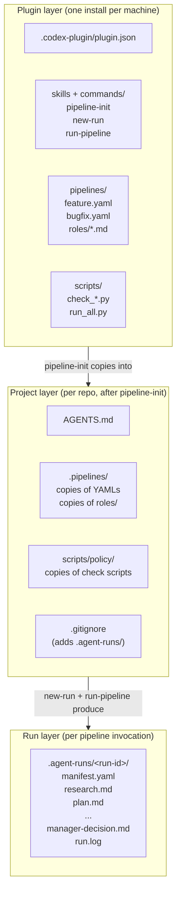
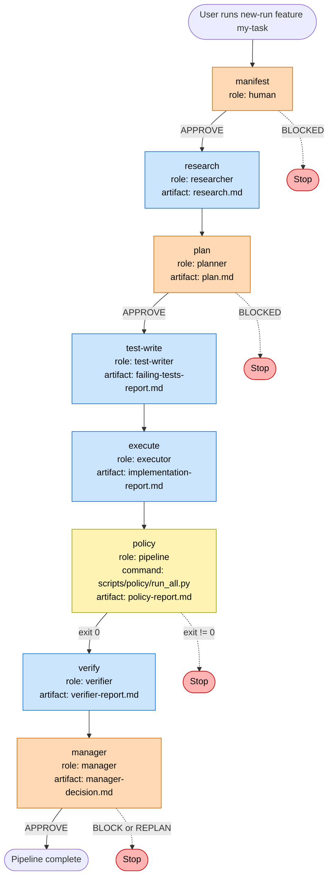
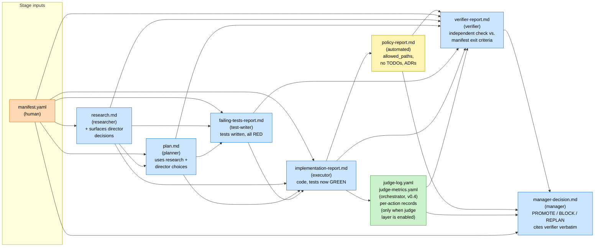
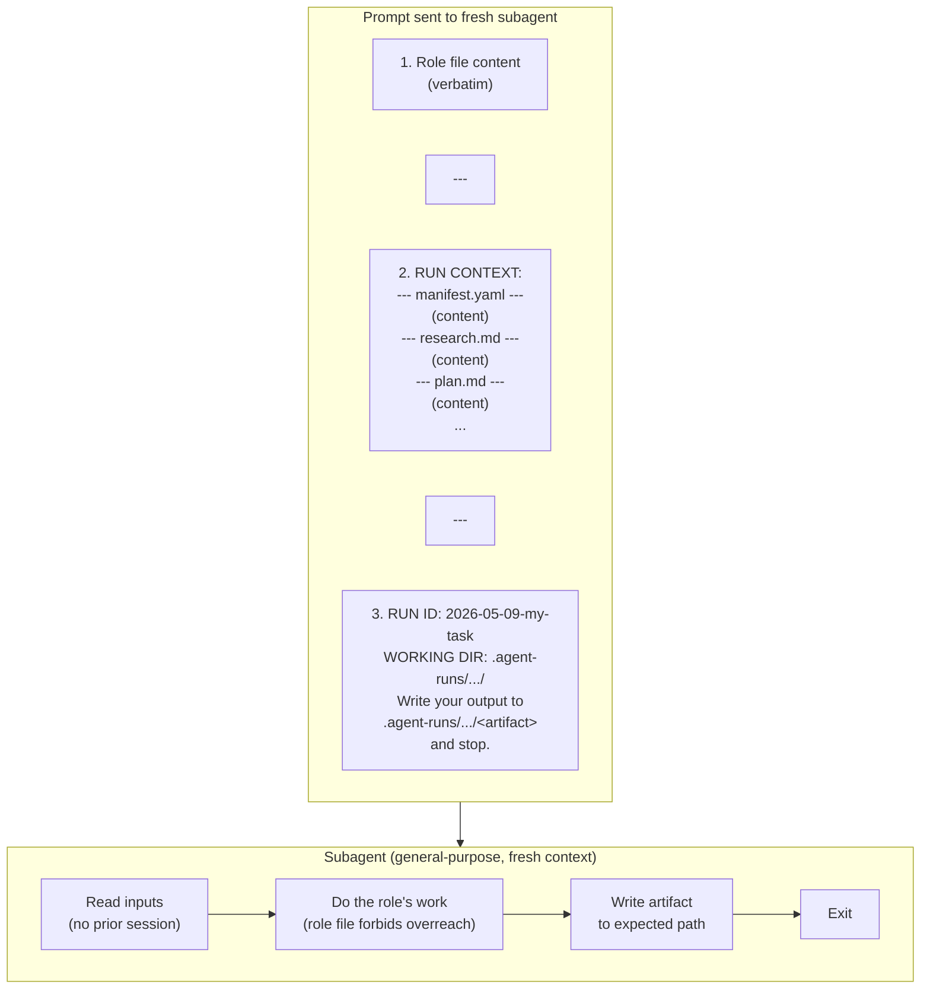
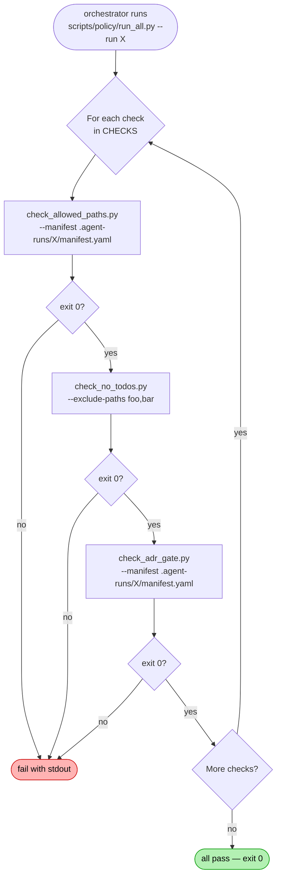
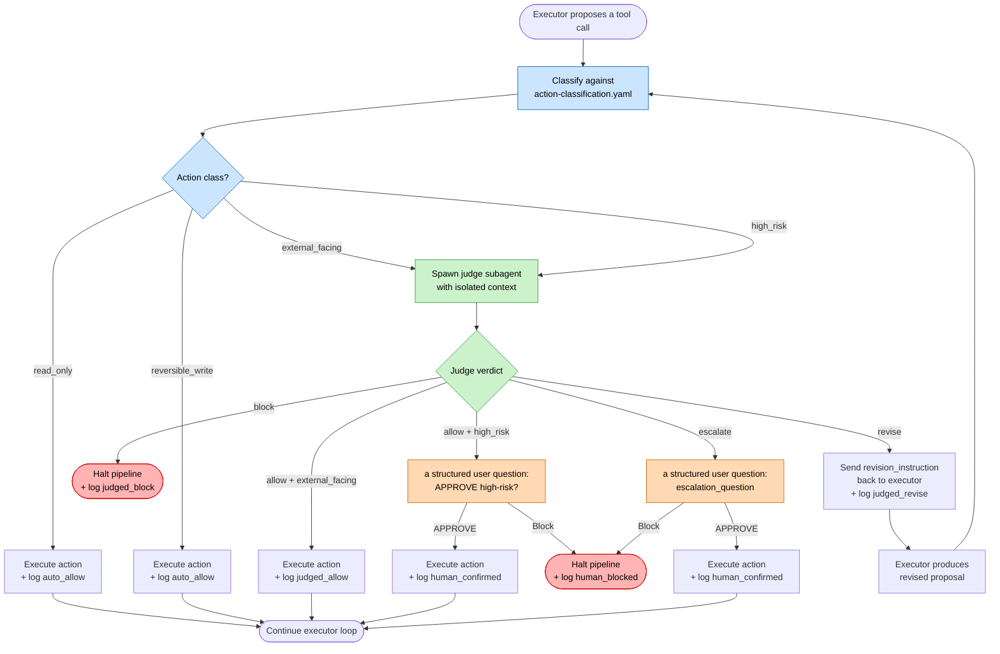
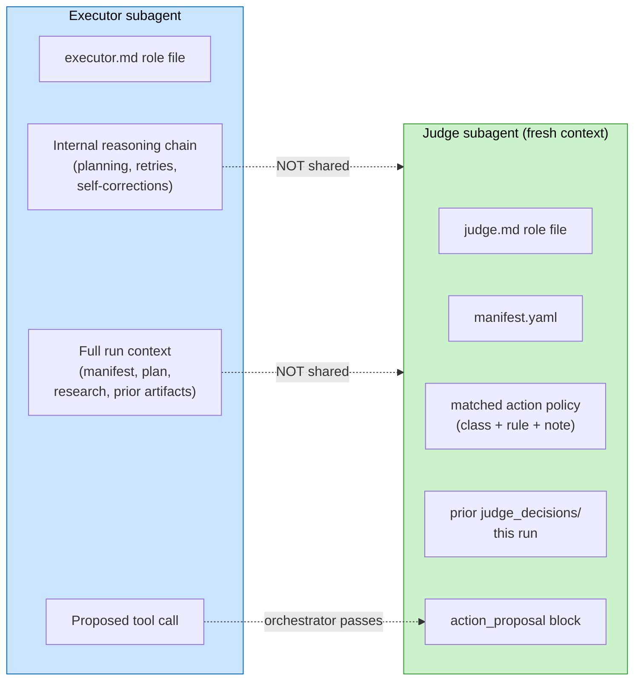
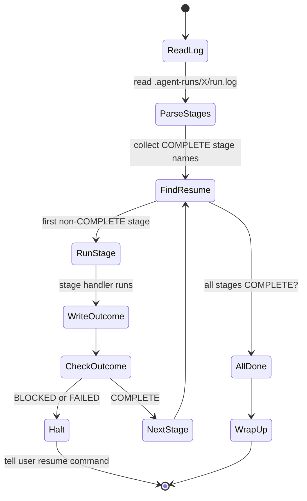

# Architecture

How the agent-pipeline-codex plugin is organized, what runs where, and which
artifact each stage produces.

This document is for two audiences:

1. **Operators** who want to understand what the plugin does on their
   machine before they trust it with a real codebase.
2. **Contributors** who want to add a new pipeline type, a new role, or a
   new policy check without breaking the contract the rest of the system
   depends on.

If you only want to run a pipeline, read [`USER-MANUAL.md`](USER-MANUAL.md)
first. This document assumes you have already done at least one run.

---

## 1. The big picture

The plugin orchestrates work across **three layers**:

1. **Plugin layer** (`agent-pipeline-codex/`) — the Codex skills, workflow specs, the
   stage definitions, the role files, and the policy scripts. Versioned,
   shared across all your projects.
2. **Project layer** (`<your-project>/`) — copies of the pipeline
   definitions, role files, and policy scripts that `pipeline-init`
   scaffolded into your project. Yours to customize.
3. **Run layer** (`<your-project>/.agent-runs/<run-id>/`) — one directory
   per pipeline run, containing the manifest, every produced artifact,
   and the append-only `run.log`. Gitignored by default.



The strict separation matters: when an agent stage runs, it only sees the
project layer and the run layer. The plugin layer is read-only template
material; once scaffolded, your project's behavior is yours.

---

## 2. Stage flow — feature pipeline

The default `feature` pipeline runs eight stages in order. Three of them
are **human-approval gates** (orange). One is an **automated policy
gate** (yellow). The rest are agent stages (blue) that delegate to a
fresh subagent per stage.



The `bugfix` pipeline collapses test-write and execute into a single
**reproduce → patch** sequence, but the gate structure is identical:
manifest gate at the start, plan gate after research, manager gate at
the end.

---

## 3. Artifact data flow

Each stage reads every prior artifact and writes exactly one new one.
This is what makes the pipeline resumable — at any point, the run
directory is the complete state.



Two important properties of this flow:

- **Append-only.** No stage modifies a prior artifact. The verifier reads
  the executor's report; it does not edit it.
- **Manager has full context.** The PROMOTE/BLOCK/REPLAN decision is made
  by an agent that has read everything and must cite verifier evidence
  verbatim. It cannot be polite or encouraging — the role file forbids
  it.

---

## 4. The three human gates

Every gate uses the same pattern: the prior stage produces an artifact,
the orchestrator pauses, and the human types `APPROVE` or describes a
block. There is no "approve with caveats" — caveats become a block, the
caveats become the next manifest.

```mermaid
sequenceDiagram
    participant U as User
    participant O as Orchestrator
    participant A as Agent (subagent)
    participant FS as .agent-runs/&lt;run-id&gt;/

    Note over U,FS: GATE 1 — manifest
    U->>O: new-run feature my-task
    O->>FS: write manifest.yaml skeleton
    O-->>U: "Fill in manifest, then re-invoke run-pipeline"
    U->>FS: edit manifest.yaml
    U->>O: run-pipeline feature 2026-05-09-my-task
    O->>U: a structured user question: APPROVE manifest?
    U->>O: APPROVE
    O->>FS: append run.log: manifest COMPLETE

    Note over U,FS: GATE 2 — plan
    O->>A: spawn researcher subagent
    A->>FS: write research.md
    O->>A: spawn planner subagent
    A->>FS: write plan.md
    O->>U: a structured user question: APPROVE plan?
    U->>O: APPROVE
    O->>FS: append run.log: plan COMPLETE

    Note over U,FS: AGENT STAGES (no gate)
    O->>A: test-writer
    A->>FS: failing-tests-report.md
    O->>A: executor
    A->>FS: implementation-report.md
    O->>O: bash policy run
    O->>FS: policy-report.md
    O->>A: verifier
    A->>FS: verifier-report.md
    O->>A: manager
    A->>FS: manager-decision.md

    Note over U,FS: GATE 3 — manager-decision
    O->>U: a structured user question: APPROVE manager decision?
    U->>O: APPROVE
    O->>FS: append run.log: manager COMPLETE
    O-->>U: Pipeline complete
```

If the user types anything other than `APPROVE` at any gate, the
orchestrator writes `BLOCKED` to `run.log` and stops. Re-invoking the
same `run-pipeline` later resumes from the next non-`COMPLETE` stage.
The log is the resume key.

---

## 5. What an agent stage actually sees

When the orchestrator spawns a subagent, it builds a prompt with three
pieces:

1. **Role file** (`.pipelines/roles/<role>.md`) verbatim — the contract
   for what this role does and what it never does.
2. **Run context** — the manifest plus every prior artifact, joined with
   `--- <filename> ---` separators.
3. **Run instructions** — the run id, the working directory, and the
   expected output filename.



The orchestrator does **not** share its conversation history with the
subagent. The subagent sees the prompt and the filesystem. That is by
design: each stage starts with a clean head and only the artifacts on
disk.

---

## 6. The policy stage

The policy stage is the only non-agent automation in the pipeline. It
runs `python scripts/policy/run_all.py --run <run-id>`, which executes
each check in `CHECKS` and aggregates results. Exit code 0 means
PROMOTE-eligible; non-zero halts the run.



The default check set is generic. To add project-specific checks,
edit `scripts/policy/run_all.py` and append entries to `CHECKS`. Each
check is a list of CLI args; `run_all.py` runs them, captures stdout +
stderr, and reports any non-zero exit.

Examples of project-specific checks worth adding:

- `check_no_secrets.py` — scan diff for credential patterns
- `check_ffmpeg_wrapper.py` — enforce that all ffmpeg calls go through
  the wrapper module
- `check_no_console_log.py` — block `console.log` in production source

---

## 7. The judge layer (v0.4) — real-time action supervision

The judge layer is **opt-in supervision inside the executor stage**. It is **not a new pipeline stage**. When `.pipelines/action-classification.yaml` exists in your project, the orchestrator uses Handler 3a (instead of the standard Handler 3) for the executor stage. Handler 3a wraps every executor tool call in a **classify → judge → execute** inner loop. The executor's role file is unchanged; the executor does not know the judge exists.

### Why this is here

Prompts don't hold across long context windows. The most expensive class of agent failure is not "the agent did nothing" but "the agent did the wrong thing because it confidently inferred authorization from inference instead of evidence." The classic example is the Lindy case (May 2026, Nate Jones): an agent sent 14 unauthorized emails because the operator's prior approvals trained the manifest-vs-action gap shut. Manual confirmation prompts don't help — operators learn to click "okay" reflexively.

The architectural fix is a second agent (the judge) whose sole loyalty is the manifest, evaluated in **context isolation** from the executor's reasoning chain. The judge cannot be persuaded by the executor's logic because it never sees it. It receives only the manifest, the action policy, prior judge decisions, and the structured action proposal.

### The classify → judge → execute inner loop



The revise loop has a hard cap of 3 cycles per `action_id`. On the 4th cycle, the orchestrator auto-escalates with the question "Executor proposed this action 4 times after revise verdicts; revision loop is not converging." This prevents the executor from looping indefinitely against a misaligned manifest.

### The four risk classes

Defined in `.pipelines/action-classification.yaml`. Rules are evaluated top-to-bottom within each class; first match wins.

| Class | Examples | Routing |
| :--- | :--- | :--- |
| `read_only` | `cat`, `grep`, `ls`, `git log`, `pytest`, `ruff check` | Execute immediately + log |
| `reversible_write` | `str_replace_editor`, `git commit`, `git add`, `cp`, `mv`, `pip install` | Execute immediately + log |
| `external_facing` | `git push` (non-main, non-force), `gh pr create`, `curl -X POST`, `docker push`, `kubectl apply` | Judge required; ALLOW executes |
| `high_risk` | `rm -rf`, `git push --force`, `git push main`, `DROP TABLE`, `npm publish`, `chmod` | Judge required; ALLOW + human confirm |

Unmatched actions default to `reversible_write` — the safer assumption for any unclassified write-like action.

### Context isolation — what the judge sees and doesn't see

The judge is invoked as a fresh Codex subagent. The orchestrator deliberately supplies only the manifest, the matched action policy, prior judge decisions for this run (so the judge can detect re-proposals of blocked actions), and the structured action proposal block.



This isolation is the mechanism. If the judge saw the executor's internal reasoning, it could be persuaded by the same chain of inferences that produced the over-broad action in the first place. Single-model-family correlated judgment defeats the purpose. Context isolation forces the judge to evaluate the action against the manifest only, using only what the executor cited as evidence.

### Artifacts produced

Two new files land in the run directory when the judge layer is active:

- **`.agent-runs/<run-id>/judge-log.yaml`** — chronological log of every action: tool, arguments, matched class, disposition (auto_allow / judged_allow / judged_revise / judged_block / judged_escalate / human_confirmed / human_blocked), and the judge's reason and revision instruction when applicable. Both the verifier and the manager read this when reasoning about the executor's run.
- **`.agent-runs/<run-id>/judge-metrics.yaml`** — aggregate counts: `total_actions`, `by_class`, `by_disposition`, `escalation_rate`, `judge_invocations`, `revision_cycles`. The escalation rate is the operator's tuning signal — see USER-MANUAL.md.

A third internal directory holds per-action verdict files for replay and audit:

- **`.agent-runs/<run-id>/judge-decisions/<action_id>.yaml`** — one YAML file per judged action, written by the judge subagent. The orchestrator parses these directly; they are also read by the next judge invocation as `prior_judge_decisions`.

### When the judge is and isn't active

- **`.pipelines/action-classification.yaml` exists in the project** → Handler 3a is used for the executor stage; the judge layer is active for that run.
- **`.pipelines/action-classification.yaml` does not exist** → Handler 3 is used for the executor stage exactly as in v0.3 and earlier; the judge layer is inactive. No `judge-log.yaml` or `judge-metrics.yaml` is produced.

The decision is made once at the start of the run. Adding or removing the file mid-run does not retroactively change a stage that has already completed; a resumed run picks up the on-disk state at resume time.

### Relationship to other gates

The judge does **not** replace any existing gate. It supplements them at a different layer:

| Layer | Catches | When |
| :--- | :--- | :--- |
| Manifest gate | Wrong scope | Before any stage runs |
| Plan gate | Wrong approach | Before any code is written |
| **Judge (v0.4)** | **Unauthorized actions** | **In real time, during executor** |
| Policy stage | Path violations, TODOs, ADR changes | After executor, before verifier |
| Verifier stage | Manifest exit criteria not met | After policy |
| Manager gate | Anything verifier marked NOT MET | Final gate before merge |

The judge catches what the others can't: real-time interception of irreversible or external actions before they execute. The policy and verifier stages run **after** the executor has already done its work; the judge runs **during** the executor's work, so it can stop the action before it lands.

---

## 8. Single-AI hardening (v0.5) — critic, drift-detector, auto-promote

The v0.5 release adds three new stages to the pipeline that compensate for dropping dual-AI cross-family verification. They run between `verify` and `manager`:

```
verify → drift-detect → critique → auto-promote → manager
```

Each is a structural substitute for a different aspect of the dual-AI handoff that v0.3 enables but does not enforce inside the pipeline.

### drift-detector

A read-only role that compares the manifest's contract (`goal`, `expected_outputs`, `definition_of_done`, `non_goals`) against the assembled final state of the run — durable docs included (`CHANGELOG.md`, `README.md`, `USER-MANUAL.md`, ADRs, any project HANDOFF). It catches the gap class neither the judge (per-action) nor the verifier (per-criterion) can see: documents that say one thing while code says another, top-level ledger totals that don't match row counts, version strings out of sync across `pyproject.toml` / `__init__.py` / `CHANGELOG.md`, status-word abuse, "Closed" without evidence.

The role emits a structured `**Drift: <total> total, <blocker> blocker**` count line that the `auto-promote` stage parses directly. Blocker drift forbids auto-promotion regardless of other conditions.

### critic

A hostile cold read of every artifact in the run, in a fresh context. The critic role file is deliberately adversarial: hard rules forbid encouragement, severity softening, "no findings" without per-lens evidence, and trusting the verifier or executor at face value. The critic walks six lenses — engineering, UX, tests, docs, QA, scope — and emits a `**Findings: <total> total, <blocker> blocker, <critical> critical, <major> major, <minor> minor**` count line that `auto-promote` parses.

The critic is the structural substitute for the v0.3 cross-agent auditor when running with a single AI. Same model family, fresh context, contrarian role contract.

### auto-promote

A `role: pipeline` stage that runs `scripts/auto_promote.py`. It reads the artifacts produced by verifier, critic, drift-detector, policy, judge (when active), and executor, then checks six conditions:

1. Verifier-clean: zero `NOT MET` and zero `PARTIAL` criteria.
2. Critic-clean: zero blocker findings and zero critical findings.
3. Drift-clean: zero blocker drift items.
4. Policy-passed: `POLICY: ALL CHECKS PASSED` in `policy-report.md`.
5. Judge-clean: zero `judged_block` and zero `human_blocked` dispositions (vacuous when the v0.4 judge layer is inactive).
6. Tests-passed: a recognizable `N passed[, 0 failed]` or `all tests passed` signal in `implementation-report.md`.

When all six pass, the script writes a preset `manager-decision.md` with `**Decision: PROMOTE**` and a citation block naming the evidence for each condition. The manager stage detects the preset (per Handler 4 in `commandsrun-pipeline.md`) and short-circuits the human-approval gate, advancing the pipeline automatically.

When any condition fails, the script writes `auto-promote-report.md` naming which conditions failed and exits 1. The manager stage runs normally with the human-approval gate active.

### Pre-edit fact-forcing in executor

The executor role file now contains a "Pre-edit fact-forcing gate" section. Before the first edit/write to any file in the run, the executor must produce a structured fact block (importers/callers, public API affected, data schema touched, manifest goal quoted verbatim). The drift-detector and critic both verify the block exists for every touched file.

### Manifest schema validation

`scripts/check_manifest_schema.py` enforces structural minimums on the manifest: `goal` ≥ 30 chars, `definition_of_done` ≥ 80 chars, non-empty `expected_outputs` / `non_goals` / `rollback_plan`, broad `allowed_paths` requires non-empty `forbidden_paths`, forbidden status words banned. Runs both at Phase A2 (run-start) and in the policy stage.

### Honest limit — single-model-family correlated blind spots

Critic and verifier run in the same model family. If both share a wrong assumption that fits the manifest, both sign off, auto-promote fires green, and the work ships wrong. Dual-AI (v0.3 cross-family audit) is the only structural defense against this. The v0.5 release does not replace v0.3; it provides single-AI projects a credible alternative when a second model family is not available. Recommended mitigation: periodic sample audit by a different model family on a weekly cadence.

---

## 9. The run.log resume mechanism

The `run.log` is the source of truth for "what's done." It is
append-only. Each line is one stage outcome. The orchestrator parses it
to decide where to start.

```
2026-05-09T14:30:00Z | manifest | COMPLETE | human approved
2026-05-09T14:32:11Z | research | COMPLETE | research.md written
2026-05-09T14:35:42Z | plan | COMPLETE | plan.md written
2026-05-09T14:35:50Z | plan | COMPLETE | human approved
2026-05-09T14:42:01Z | test-write | COMPLETE | failing-tests-report.md written
2026-05-09T14:51:33Z | execute | FAILED | artifact not produced (or empty)
```



This means:

- A `BLOCKED` or `FAILED` line does **not** mark the stage as done.
  Re-running picks up at that stage.
- The user never edits `run.log`. If a stage's outcome is wrong, the fix
  is in the underlying artifact or manifest, not the log.
- Crash-safety: if the orchestrator dies mid-stage, the missing
  `COMPLETE` line means the next run starts at that stage cleanly.

---

## 10. File layout — every file explained

```
agent-pipeline-codex/                        # the plugin
├── .codex-plugin/
│   └── plugin.json                      # plugin metadata, version
├── README.md                            # quick-start
├── USER-MANUAL.md                       # operator-facing
├── ARCHITECTURE.md                      # this file
├── CHANGELOG.md                         # version history
├── LICENSE                              # Apache-2.0
├── docs/
│   └── index.html                       # GitHub Pages landing page
├── commands/
│   ├── pipeline-init.md                 # pipeline-init logic
│   ├── new-run.md                       # new-run logic
│   └── run-pipeline.md                  # run-pipeline logic (orchestrator)
├── pipelines/
│   ├── feature.yaml                     # 8-stage feature flow
│   ├── bugfix.yaml                      # 7-stage bugfix flow
│   ├── manifest-template.yaml           # blank skeleton
│   ├── action-classification.yaml       # v0.4 — opt-in judge layer rules
│   └── roles/
│       ├── researcher.md                # surfaces director decisions
│       ├── planner.md                   # produces plan.md §1-7
│       ├── test-writer.md               # writes failing tests only
│       ├── executor.md                  # makes tests green
│       ├── verifier.md                  # independent fresh-context check
│       ├── manager.md                   # PROMOTE/BLOCK/REPLAN decision
│       └── judge.md                     # v0.4 — per-action real-time verdict
└── scripts/
    ├── __init__.py
    ├── check_allowed_paths.py           # diff vs. manifest allowed_paths
    ├── check_no_todos.py                # scan for TODO/FIXME/HACK
    ├── check_adr_gate.py                # ADRs are append-only
    └── run_all.py                       # check runner
```

After `pipeline-init`, your project gets:

```
<your-project>/
├── AGENTS.md                            # scaffolded if absent
├── .gitignore                           # adds .agent-runs/
├── .pipelines/                          # copy of plugin's pipelines/
│   ├── feature.yaml
│   ├── bugfix.yaml
│   ├── manifest-template.yaml
│   └── roles/...
├── scripts/policy/                      # copy of plugin's scripts/
│   ├── __init__.py
│   ├── check_allowed_paths.py
│   ├── check_no_todos.py
│   ├── check_adr_gate.py
│   └── run_all.py
└── .agent-runs/                         # gitignored, created on first new-run
    └── <run-id>/
        ├── manifest.yaml
        ├── research.md
        ├── plan.md
        ├── failing-tests-report.md
        ├── implementation-report.md
        ├── policy-report.md
        ├── verifier-report.md
        ├── manager-decision.md
        ├── judge-log.yaml               # v0.4 — written when judge layer is active
        ├── judge-metrics.yaml           # v0.4 — written when judge layer is active
        ├── judge-decisions/             # v0.4 — one YAML per judged action
        │   └── exec-NNN.yaml
        └── run.log
```

---

## 11. Extension points

The plugin is designed for projects to extend, not fork. The places to
extend:

| Extension | Where | Constraint |
|---|---|---|
| New pipeline type | `.pipelines/<name>.yaml` | Must use existing role names or add a role file |
| New role | `.pipelines/roles/<name>.md` | Must produce exactly one named artifact and stop |
| New policy check | `scripts/policy/check_<name>.py` + entry in `CHECKS` | Exit 0 = pass, non-zero = fail; print to stdout |
| Project conventions | `AGENTS.md` | Roles read this; the planner is required to honor it |
| Manifest fields | `.pipelines/manifest-template.yaml` | Add field + inline comment; downstream roles may reference it |
| Judge classification rules | `.pipelines/action-classification.yaml` | Add entries under the appropriate class; first-match-wins per class; file presence opts the run into the judge layer |

Anti-patterns to avoid:

- Editing the role files mid-run. The contract changes mid-flight and the
  manager's verdict becomes meaningless.
- Editing the manifest mid-run. The orchestrator treats the manifest as
  immutable; if it needs to change, the manager returns REPLAN and you
  re-issue `new-run`.
- Adding a stage that produces multiple artifacts. The pipeline's resume
  logic and the verifier's input both depend on one-artifact-per-stage.
- Removing the manifest, plan, or manager gates. The plugin is built
  around three explicit gates; removing one means the run can promote
  without human review at a critical moment.

---

## 12. Why these defaults

Several non-obvious defaults exist because of real failures from prior
projects.

| Default | Reason |
|---|---|
| Three human gates, not two or four | Fewer means autonomous-mode-by-stealth; more means humans rubber-stamp |
| Manager must cite verifier verbatim | Encouragement and summarization let bad runs PROMOTE |
| Policy checks exit non-zero halts pipeline | "It's just a warning" is how scope creep gets in |
| Halt applies to ALL repo state, including unrelated cleanup | Otherwise an agent merges in-flight work while a question is open |
| `run.log` is append-only | Editing the log to "fix" a stage hides the underlying bug |
| Subagents have fresh context | Otherwise the executor inherits the planner's blind spots |
| Manifest has `forbidden_paths` not just `allowed_paths` | Belt-and-suspenders for high-risk dirs (e.g., production configs) |
| `definition_of_done` is required | Without it, the verifier has no objective check |
| Director-decisions are surfaced by the researcher, not the planner | The planner picks; if the researcher picked, no human got to weigh in |
| Cleanroom CI is recommended, not enforced | Some projects don't have Docker available; recommend strongly, don't gate |

If you find yourself wanting to override one of these, that's a real
decision worth recording in your project's `docs/adr/` directory.

---

## 13. Sequence summary — what happens end-to-end

```mermaid
sequenceDiagram
    autonumber
    participant U as User
    participant CC as Codex Desktop App
    participant Plugin as agent-pipeline-codex plugin
    participant Proj as your project
    participant Runs as .agent-runs/&lt;run-id&gt;/

    U->>CC: pipeline-init
    CC->>Plugin: read commandspipeline-init.md
    CC->>U: ask: PRD / repo / description?
    U->>CC: PRD path or repo URL or description
    CC->>Proj: scaffold .pipelines/, scripts/policy/, AGENTS.md
    CC->>U: orientation summary; suggest new-run

    U->>CC: new-run feature my-task
    CC->>Plugin: read commandsnew-run.md
    CC->>Runs: create dir + manifest.yaml skeleton
    CC->>U: display manifest; instruct to fill in
    U->>Runs: edit manifest.yaml

    U->>CC: run-pipeline feature 2026-05-09-my-task
    CC->>Plugin: read commandsrun-pipeline.md
    loop for each stage
        CC->>Runs: read run.log to find resume point
        alt human gate
            CC->>U: a structured user question: APPROVE?
            U->>CC: APPROVE or block
        else policy stage
            CC->>Proj: bash scripts/policy/run_all.py
        else agent stage
            CC->>Plugin: read role file
            CC->>CC: spawn subagent with role + context
            CC->>Runs: subagent writes artifact
        end
        CC->>Runs: append run.log line
    end
    CC->>U: pipeline complete; show manager decision
```

---

## 14. Glossary

- **Manifest** — the human-authored contract for a single run. Lists
  goal, allowed paths, forbidden paths, non-goals, expected outputs,
  required gates, risk, rollback plan, definition of done, director
  notes.
- **Stage** — one entry in the pipeline YAML. Has a `name`, a `role`, an
  `artifact`, and optionally a `gate` or a `command`.
- **Role** — the kind of work a stage does. Defined in
  `.pipelines/roles/<role>.md`.
- **Artifact** — the single named file a stage produces, written into
  `.agent-runs/<run-id>/`.
- **Gate** — a checkpoint where the pipeline halts. Either
  `human_approval` (operator must type APPROVE) or implicit (a failing
  policy check or empty artifact).
- **Subagent** — a fresh Codex Desktop App agent spawned by the orchestrator
  for a single stage. Has no memory of the orchestrator's session.
- **Run ID** — `YYYY-MM-DD-<slug>`, the directory name under
  `.agent-runs/`.
- **Director** — the human who approves the manifest, the plan, and the
  manager decision.
- **Director notes** — free-form section in the manifest where the
  director records goals, constraints, and prior decisions that the
  researcher must surface.
- **Cleanroom CI** — a Docker-based reproduction of the test environment
  with a fresh dependency set, used to catch "works on my machine"
  bugs that local pytest misses.
- **Judge** (v0.4) — a fresh-context subagent whose only job is to
  evaluate a single proposed executor action against the manifest and
  return one of four verdicts: `allow`, `block`, `revise`, or
  `escalate`. Context-isolated from the executor's reasoning chain by
  design.
- **Action class** (v0.4) — the risk category assigned to each executor
  tool call by `.pipelines/action-classification.yaml`. One of
  `read_only`, `reversible_write`, `external_facing`, or `high_risk`.
  Determines whether the action is auto-executed, judged, or
  judged-plus-human-confirmed.
- **Escalation rate** (v0.4) — the fraction of executor actions that
  reach a human via the judge layer. The operator's tuning signal:
  too low means the classification rules are too permissive; too high
  means the rules are too tight and trust is being eroded by the
  cookie-banner effect.
